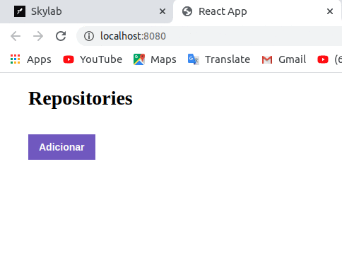

# Concepts reactjs - Challenge

  

## Application Features
<ul>
<li> List your API repositories: You should be able to create a list with the title field of all the repositories that are registered with your API. </li>

<li> Add a repository to your API: You should be able to add a new item to your API via a button with the text Add and, after creation, you should be able to display its name after registration. </i >

<li> Remove a repository from your API: For each item on your list, you must have a button with the text Remove which, when clicked, will call a function to remove that item from the list of your frontend and your API. </ li>
</ul>

## Testing Specification

In each test, you have a brief description of what your application must do in order for the test to pass.

For this challenge we have the following tests:
<ul>
<li> should be able to add new repository: For this test to pass, your application must allow a repository to be added to your backend and listed on your frontend within a li. </li>

<li> should be able to remove repository: In order for this test to pass, your application must allow that by clicking on the remove button that will be inside the li of the added repository, the item is removed from the list. </li>
</ul>
